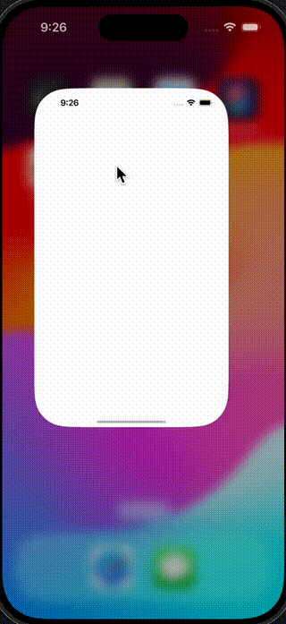

# 🏇🏼 Music Hub
This a simple project demonstrate some examples of **clean architecture**, **code organisation**, **loose coupling**, **unit testing**, and some of the best practices used in modern iOS programming using `Swift` & `SwiftUI`

### 💼 App Goal & Requirements
The app will have 3 tabs, Rooms, Now Playing and Settings.
 - Rooms
 Show a list of music devices (fetched from the server/ cloud data)
 For each device show Device name, Artwork, Track name, Artist name, Playback state (playing/paused)
When a device is selected in the Rooms view the Now Playing view will update to show what is playing on that device

- Now Playing
For the selected player on the Rooms view show Selected device name, Artwork, Track title, album title, Artist name, Play / Pause button (Pause button when playing, Play button when paused)). When the Play / Pause button is tapped the Rooms view will update the playing state for the selected device

- Settings
Show a switch control with the label “Mock Data” which is off by default
When the “Mock Data” setting is enabled the app should fetch local dummy data.
When the “Mock Data” setting is disabled the app should fetch its data from the cloud.

## 👨🏽‍💻  Solution Approach

> Before we move onto breaking down the app layers and architecture, let's  read some of the best practices and how other SwiftUI developers in the community are feeling about various ways to architect a scalable app. 

>> This article on [clean-architecture-swiftui](https://nalexn.github.io/clean-architecture-swiftui/) summarises the story quite well 🙏🏽

| Clean Architecture with MVVM |
| ---------------------------  |
|  |

After reading it, I made this following decisions to go ahead and use some aspects of the `VIPER` pattern and mixing in with `MVVM` while still having core concepts of `clean architecture` from uncle Bob 🧔🏼‍♂️. 

Codebase is broken down into 3 logical layers (via `Swift Packages`)
- `DataLayer`:
    - Network fetching of raw data and JSON decoding via URL, error code mapping etc.
- `DomainLayer`:
    - Business logic combining data based and chain multiple API calls to flatten into new data structure as business logic
    - `UseSase`s live here. (aka. `Interactor` in some codebases)
- `PresentationLayer`:
    - Domain data to SwiftUI binding logic
    - All UI specific code (SwiftUI OR UIKit)
    

- A mix of **`MVVM`** and **`VIPER`** design pattern is used to achieve loose coupling and unit testing via **`Dependency Injection`** patterns and mocks
- Currently use Apple's `Combine` based `Reactive Binding`.
- Also used **`Async Await`** paradigm at the middle use-case business layer
- Some TODO notes left in the code deliberately for potential improvements and SwiftLint warns us about those to trace them

The package dependencies (import logic from one to another) are shown below:

 
Please refer from the project navigator in Xcode to see the layering.

| Project Structure | App targets |
| ------ | ------ |
|  |  |

 **NOTE:** For running the app, use use the main `MusicHub` target to run on a simulator. 

## 💻 Installation
 - Xcode 15 or later (required)
 - Clean build /DerivedData folder if any
 - Let the Swift package Manager load and sync
 - Build the project and let the Swift Package Manager pulls the remote **`SwiftLint`** plugin
 - **iOS 16** minimum support needed

## Screenshots

| Main functionalities | Mock Data mode |
| ------ | ------ |
|   |   |

